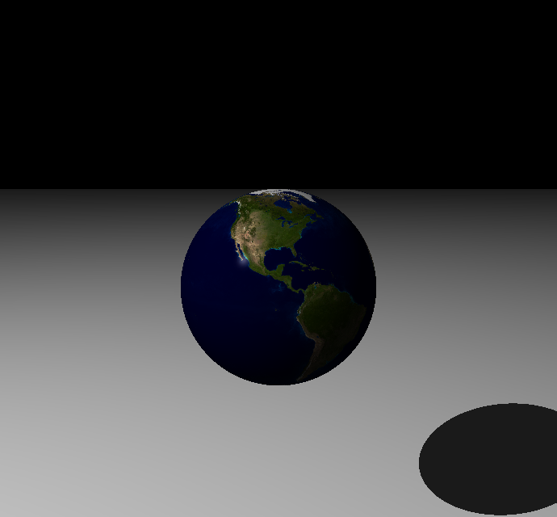

# RayTracer


[](https://github.com/12mB7693/A-raytracer-in-python/actions/workflows/tests.yml)
[](https://codecov.io/gh/12mB7693/A-raytracer-in-python)


## Overview

This repository contains the implementation of a raytracer written in Python based on the book _The ray tracer challenge: a test-driven guide to your first 3D renderer_ [^1].
The implementation supports rendering spheres and planes with custom colors, patterns, and textures. The image below was rendered using a 2D projection of the earth [^2] as a texture.





<!--
## Technical details
To improve performance, the custom matrix and vector arithmetic implementations have been replaced with NumPy’s built-in functions.
-->

## For users

### With Docker

Clone the repository and change into the project root (where the `Dockerfile` is located). Build the Docker image with:
```bash
docker build -t python-raytracer .
```
To render the output image, run the Docker container:
```bash
docker run -v "$(pwd)/imgs:/app/imgs" --rm python-raytracer
```
On Linux, you may need to run the commands with root privileges:
```bash
sudo docker build -t python-raytracer .
sudo docker run -v "$(pwd)/imgs:/app/imgs" --rm python-raytracer
```
After the container finishes, you can find the rendered image `output.ppm` in the local `imgs` folder of this repository.

### Manual installation

Install the Python package manager [uv](https://docs.astral.sh/uv/getting-started/installation/). Clone the repository and change into the project root.

To render the output image, run:
```python
uv run python -m src.raytracer.main
```
After the computation finishes, you can find the rendered image `output.ppm` in the local `imgs` folder of this repository.

## For developers

Install the Python package manager [uv](https://docs.astral.sh/uv/getting-started/installation/). 

<!-- 

To install the requirements run the following command in the terminal 
```
uv pip install -r requirements.txt
# or
uv add --dev -r requirements-dev.txt
```

run uv sync regularly

-->

Run tests via
```bash
uv run python -m pytest
```

or run single tests with
```bash
uv run python -m pytest tests/test_module_name.py::test_name
```

Check for errors and warnings via
```bash
uv run mypy -m src.raytracer.file_name
```

Compute Code Coverage locally
<!-- uv add --dev coverage-badge -->
```bash
uv run coverage-badge -o coverage.svg
```

## Credits / References

[^1]: Buck, Jamis. "The ray tracer challenge: a test-driven guide to your first 3D renderer." (2019): 1-250.

<!-- Shirley, Peter, Michael Ashikhmin, and Steve Marschner. Fundamentals of computer graphics. AK Peters/CRC Press, 2009. -->

[^2]: Earth Texture Image: “The Blue Marble: Land Surface, Ocean Color and Sea Ice,” NASA (MODIS / Terra satellite). Available at: https://visibleearth.nasa.gov/images/57730/the-blue-marble-land-surface-ocean-color-and-sea-ice
